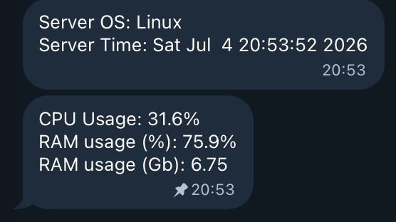
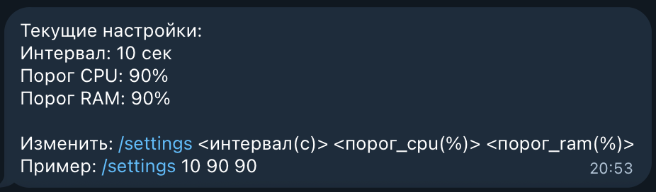
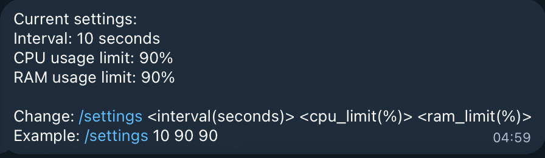

# **RUS**
Простой ТГ-бот для уведомлений о проблемах с ресурсами сервера. Проект сделан как простое решение для локальной машины без веб-интерфейса. (Надеюсь у меня дойдут руки сделать мульти-серверное решение, зачем не знаю, но хочу)
Информация о сервер выводится в двух сообщениях:
1. ОС сервера и время сервера
2. На сколько % занят процессор и оперативка и значение в GB оперативки

Настройка параметров для уведомлений о проблемах с ресурсами производится посредством команды /settings

## Установка
1. Скачать .zip архив (Скорее всего будет сделан образ)
2. Переименовать .env-example -> .env и вставить свой токен бота и получить id пользователя и вставить его (можно сделать через @userinfobot)
3. В командной строке перейти в директорию проекта и прописать: pip install -r requirements.txt
4. Запустить main.py
# ENG
Simple TG-bot for notifications. when server resources are used above limit. Project is made as simple single-server solution via Telegram. (Hope I will make it possible to support multiple servers idk for what reason just want to)
Server info is provided in two separate messages:
1. Server OS and server time which is non updatable and create on start up
2. Resource usage of CPU and RAM updated every 10 seconds as default

To set up your own parameters and see current settings you can click on button "Settings" and to edit settings you need to type /settings in chat with parameters

## Installation
1. Download as .zip (Some day I will make it as image)
2. Rename .env-example -> .env and place your token and get your id at @userinfobot
3. In command line get into directory of project and do: pip install -r requirements.txt
4. Startup main.py
